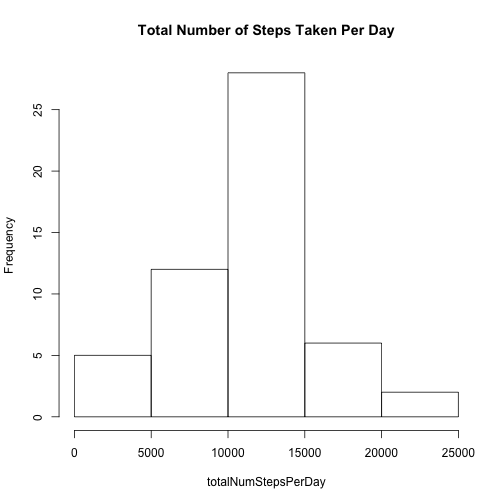
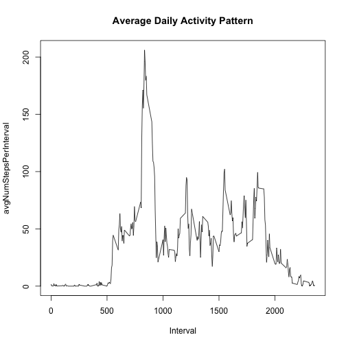
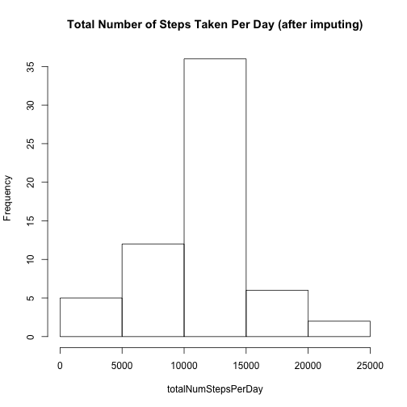
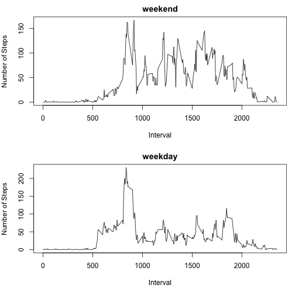

===
Reproducible Data Research - Assignment 1
===


**Loading and preprocessing the data**		
1.Load the data      
2.Process/transform the data into a format suitable for analysis     

```r
df<-read.csv("activity.csv", sep=",")		
```

**What is mean total number of steps taken per day?**    
1. Calculate the total number of steps taken per day     
2. Make a histogram of the total number of steps taken each day      
3. Calculate and report the mean and median of the total number of steps taken per day     

```r
totalNumStepsPerDay <- tapply(df$steps, df$date, sum)
hist(totalNumStepsPerDay, main="Total Number of Steps Taken Per Day")
```

 

```r
summary(totalNumStepsPerDay)
```

   Min. 1st Qu.  Median    Mean 3rd Qu.    Max.    NA's 
     41    8841   10760   10770   13290   21190       8 

**What is the average daily activity pattern?**    
1. Make a time series plot (i.e. type = "l") of the 5-minute interval (x-axis) and the average number of steps taken, averaged across all days (y-axis)     
2. Which 5-minute interval, on average across all the days in the dataset, contains the maximum number of steps?     


```r
avgNumStepsPerInterval<-tapply(df$steps, df$interval, mean, na.rm=TRUE)
Interval<-unique(df$interval)
plot(Interval,avgNumStepsPerInterval, type="l", main="Average Daily Activity Pattern")
```

 


```r
peakInterval<-max(avgNumStepsPerInterval)
peakIntervalId<-Interval[which(avgNumStepsPerInterval==peakInterval)]
```
The 5-minute interval (identifier) containing the averaged maximum number of steps is 835.     

**Imputing missing values**      
1. Calculate and report the total number of missing values in the dataset (i.e. the total number of rows with NAs)      
2. Devise a strategy for filling in all of the missing values in the dataset. The strategy does not need to be sophisticated. For example, you could use the mean/median for that day, or the mean for that 5-minute interval, etc.    
3. Create a new dataset that is equal to the original dataset but with the missing data filled in.      
4. Make a histogram of the total number of steps taken each day and Calculate and report the mean and median total number of steps taken per day. Do these values differ from the estimates from the first part of the assignment? What is the impact of imputing missing data on the estimates of the total daily number of steps?      

```r
numMissings<-sum(is.na(df$steps))

myImput<-function(x,fun) {
   missings<-is.na(x)
   x[missings]<-fun(x[!missings])
   x
   ##another way is to use replace command:
   ##replace(x, missings, fun(x[!missings]))
}
## Note: a generic function fun can be any form: mean, median,min,max, here we just implemented mean for instance.
df2<-ddply(df, ~interval, transform, steps=myImput(steps,mean))

totalNumStepsPerDay <- tapply(df2$steps, df2$date, sum)
hist(totalNumStepsPerDay, main="Total Number of Steps Taken Per Day (after imputing)")
```

 

```r
summary(totalNumStepsPerDay)
```

   Min. 1st Qu.  Median    Mean 3rd Qu.    Max. 
     41    9819   10770   10770   12810   21190 

1. The total number of missing values in the dataset is 2304.     
2. The strategy I designed is to replace those missing values (NAs) with a meaningful value (e.g. mean, median) of the group (e.g. per interval) they belong to. Note: grouping per date has problem since in some days all records are NAs so that no mean/median for that date can be obtained!      
3. The new dataset was stored in the created data frame df2.      
4. They are different indeed from the first part. To be specific: the estimated median value, 1st Qu. 3rd Qu. all have moved towards the mean value, due to the fact that we were using the statistical mean value to replace all NAs (i.e. more samples with "artificial" mean values).    

**Are there differences in activity patterns between weekdays and weekends?**

```r
wd<-weekdays(as.Date(df2$date))
isWeekend<-((wd=="Saturday")|(wd=="Sunday"))
wd[isWeekend]="weekend"
wd[!isWeekend]="weekday"
wd<-as.factor(wd)
df2<-mutate(df2, weekdays=wd)
df2_weekend<-subset(df2, weekdays=="weekend")
df2_weekday<-subset(df2, weekdays=="weekday")
par(mfrow=c(2,1),mar=c(5,4,2,1))
plot(Interval,tapply(df2_weekend$steps,df2_weekend$interval,mean),type="l", main="weekend", ylab="Number of Steps")
plot(Interval,tapply(df2_weekday$steps,df2_weekday$interval,mean),type="l", main="weekday", ylab="Number of Steps")
```

 

Observations on activity difference between weekend and weekdays:      
1. Very interesting, the subject is more active (i.e. busier with more assorted activities) during weekends, with multiple peaks occuring during weekends, whereas there is only one single activity spike during weekdays    
2. But the subject is more relaxing during the weekend, with the highest number of steps a bit more than 150 per interval; whereas the subject's highest number of setps per interval at weekdays is well more than 200!           
